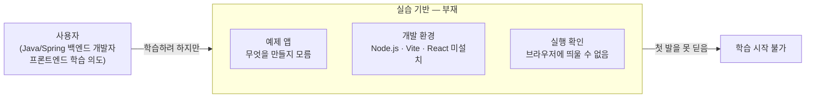

# 문제 정의 — 예제 프로젝트 셋업

## AS-IS 다이어그램

## 흐름 설명

프론트엔드를 학습하려는 의도가 있지만, 실습 기반이 전혀 없어 학습이 시작되지 않는다. 무엇을 만들지 방향이 없고, 개발 환경도 없고, 코드를 써서 브라우저로 확인하는 실행 환경도 없다. 세 가지 부재가 겹쳐 첫 발을 못 딛는 상태다.

## 컴포넌트 설명

- **사용자** — Java/Spring 백엔드 개발자. 프론트엔드 학습 의도는 있지만 실제로 시작한 적 없다.
- **예제 앱 (부재)** — 무엇을 만들지 정해진 것이 없다. 방향 없이 환경부터 셋업하면 실습 대상이 없어 학습이 공허해진다.
- **개발 환경 (부재)** — Node.js · Vite · React · TypeScript가 설치되어 있지 않다. 코드를 작성할 수 있는 도구 자체가 없는 상태.
- **실행 확인 (부재)** — 작성한 코드를 브라우저에서 확인하는 흐름이 없다. 개발 환경이 없으니 실행 자체가 불가능하다.
- **학습 시작 불가** — 세 가지 부재가 겹쳐 학습의 첫 단계에 진입하지 못하는 상태.
