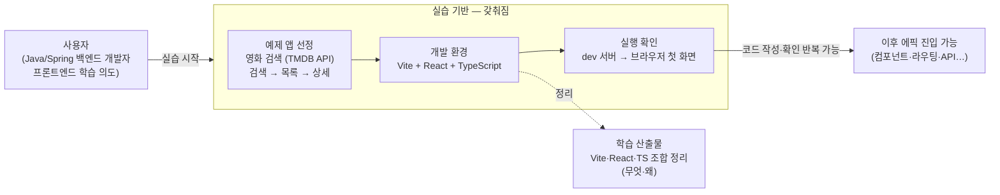

# 해결 방안 — 예제 프로젝트 셋업

## TO-BE 다이어그램

## 흐름 설명

학습 의도가 실습 기반 위에서 실제로 시작된다. 먼저 무엇을 만들지(영화 검색 앱)가 정해지고, 그 앱을 만들 개발 환경(Vite + React + TypeScript)이 갖춰지고, dev 서버를 띄워 브라우저에서 첫 화면을 확인하는 흐름이 생긴다. 세 가지 부재가 채워지면 코드 작성 → 브라우저 확인 반복이 가능해지고, 이후 에픽(컴포넌트·라우팅·API 연동…)이 이 기반 위에서 진행된다.

AS-IS에서 부재(MISSING)였던 세 자리가 그대로 갖춰진(BASE) 자리로 바뀌고, "학습 시작 불가" 막힘이 "이후 에픽 진입 가능"으로 열린 것이 핵심 변화다. 여기에 더해, 개발 환경을 갖추는 과정에서 *학습 산출물*(Vite·React·TypeScript가 무엇이고 왜 이 조합인지 정리한 노트)이 함께 나온다 — 프론트엔드 학습이 목적인 프로젝트이므로, 셋업이 동작하는 것에서 그치지 않고 *무엇을 왜 했는지*가 정리되어야 한다.

## 컴포넌트 설명

- **예제 앱 선정** — 영화 검색 앱(TMDB API). 검색 → 목록 → 상세 흐름. 무엇을 만들지가 정해져 이후 모든 에픽의 실습 대상이 된다.
- **개발 환경** — Vite + React + TypeScript. 빠른 dev 서버와 타입 안전성을 갖춘 표준 조합. AS-IS의 미설치 상태를 채운다.
- **실행 확인** — dev 서버를 띄워 브라우저에 첫 화면을 띄우는 흐름. 코드 작성 결과를 즉시 눈으로 확인하는 반복 루프의 시작점.
- **학습 산출물** — Vite·React·TypeScript 조합이 무엇이고 왜 이 조합을 골랐는지 정리한 노트. `problems/frontend-development/outcome/` 아래 누적. 코드는 `movie-search` 레포, 학습 정리는 process-engineering outcome으로 역할을 나눈다.
- **이후 에픽 진입 가능** — 실습 기반이 갖춰져 컴포넌트·라우팅·API 연동 등 후속 에픽이 진행될 수 있는 상태. 이 에픽의 닫힘 조건(시연 가능한 첫 결과물 = 브라우저에 뜨는 화면)이 곧 다음 에픽들의 출발점.

## 미결정

- TMDB API 키 발급·환경변수 관리 방식 (`.env` 처리) — plan-stories 또는 API 연동 에픽에서 구체화.
