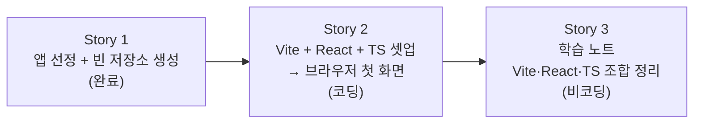

# 예제 프로젝트 셋업 — Story 목록

선행: [../2-explore/explore-solutions.md](../2-explore/explore-solutions.md)

## 전체 흐름

Story 1에서 무엇을 만들지(영화 검색 앱)와 빈 저장소가 정해졌다. Story 2가 그 저장소에 개발 환경을 깔고 브라우저에 첫 화면을 띄운다. Story 3은 그 과정에서 무엇을 왜 했는지 학습 노트로 남긴다. 셋업이 끝나야 학습 노트를 쓸 실체가 생기므로 S2 → S3 순서다.

## Story 1 — 예제 앱 선정 + 빈 저장소 생성 (완료)

### 목적
이후 모든 에픽의 실습 대상이 될 예제 앱을 정하고, 코드를 담을 빈 저장소를 만든다.

### 실행 완료 기준
- 영화 검색 앱(TMDB API — 검색 → 목록 → 상세)으로 확정
- `workspace-pe/movie-search` 저장소 생성 + README

### 결과
완료 — `movie-search` 레포 초기 커밋(`52d6121`).

## Story 2 — Vite + React + TypeScript 셋업 + 브라우저 첫 화면 (코딩)

### 목적
`movie-search` 저장소에 Vite + React + TypeScript 개발 환경을 깔고, dev 서버를 띄워 브라우저에 첫 화면이 뜨는 것까지 확인한다.

### 실행 완료 기준
- `npm create vite` 기반 React + TS 프로젝트 구조 생성
- `npm run dev` 로 dev 서버 구동 → 브라우저에 기본 화면 표시
- 불필요한 보일러플레이트 정리(첫 화면이 영화 검색 앱의 시작점임을 알 수 있는 최소 수준)
- `movie-search` 레포에 *프로젝트 단위* VSCode 설정 — `.vscode/extensions.json`(권장 확장)·workspace settings, React+TS 인식 설정(ESLint·Prettier). 레포에 커밋

### 경계
- VSCode 자체 + 전역 확장 설치는 *개발 환경 관리* 프로젝트("VSCode 신규 도입" 에픽, 완료)의 영역. 여기서는 *이 레포에 묶이는* 프로젝트 단위 설정만 다룬다.

### ADR 후보
- 없음 (Vite + React + TS는 explore 단계에서 확정된 표준 조합)

## Story 3 — 학습 노트: Vite·React·TS 조합 정리 (비코딩)

### 목적
Story 2에서 깐 개발 환경이 *무엇이고 왜 이 조합인지* 정리한 학습 노트를 남긴다. 프로젝트 운영 원칙(모든 에픽은 학습 산출물을 남긴다)의 첫 적용.

### 실행 완료 기준
- `problems/frontend-development/outcome/` 아래 학습 노트 작성
- 담을 내용: Vite가 무엇·왜(번들러 대비), React 역할, TypeScript를 쓰는 이유, 이 셋이 어떻게 맞물리는지
- 프로젝트 단위 VSCode 설정이 React/TS를 어떻게 인식·지원하는지 — 권장 확장(ESLint·Prettier 등)이 각각 무슨 역할인지
- 백엔드 개발자 관점에서 *익숙한 것과의 대비*로 이해되게 (예: Vite ↔ 빌드 도구, npm ↔ 의존성 관리)
