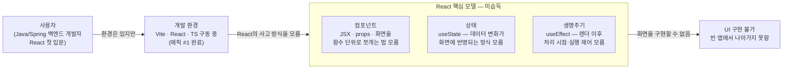

# 문제 정의 — React 핵심: 컴포넌트·상태·생명주기

## AS-IS 다이어그램

## 흐름 설명

에픽 #1에서 Vite + React + TS 개발 환경이 갖춰졌고, 브라우저에 첫 화면을 띄우는 것까지 완료됐다. 환경은 있지만 그 위에서 무엇을 어떻게 써야 하는지를 모른다. Java/Spring 백엔드 개발자에게는 익숙한 클래스·메서드 단위의 사고방식이 있지만, React는 UI를 컴포넌트(함수 단위)로 쪼개고, 데이터 변화를 상태로 선언하고, 렌더 이후 처리를 생명주기로 제어하는 별도의 사고 모델을 요구한다. 이 모델이 없으면 빈 앱에서 한 발짝도 나아가지 못한다.

## 컴포넌트 설명

- **사용자** — Java/Spring 백엔드 개발자. React 학습 의도가 있고 개발 환경은 갖췄지만, React 고유의 UI 사고 방식은 아직 없다.
- **개발 환경** — Vite + React + TS가 구동 중인 `movie-search` 레포. 에픽 #1에서 완성된 기반으로, 코드를 작성하면 브라우저에서 즉시 확인할 수 있다.
- **컴포넌트 (미습득)** — UI를 독립된 함수 단위로 쪼개는 React의 기본 단위. JSX 문법과 props(부모→자식 데이터 전달)를 포함한다. 이 개념이 없으면 화면을 구조화하는 방법이 없다.
- **상태 (미습득)** — `useState` 훅. "데이터가 바뀌면 화면도 바뀐다"는 반응성 모델. 백엔드의 변수 할당과 달리, 상태 변경이 리렌더를 트리거한다는 점이 낯설다.
- **생명주기 (미습득)** — `useEffect` 훅. 컴포넌트가 렌더된 이후에 실행할 처리(API 호출·이벤트 구독·타이머 등)와 그 실행 시점을 제어하는 방법. 의존성 배열이 언제 어떻게 동작하는지가 핵심이다.
- **UI 구현 불가** — 세 개념이 모두 빠진 상태에서는 컴포넌트를 만들 수도, 검색어 입력을 받아 화면을 갱신할 수도, API를 호출할 타이밍을 잡을 수도 없다. 빈 앱이 그대로 남는다.
