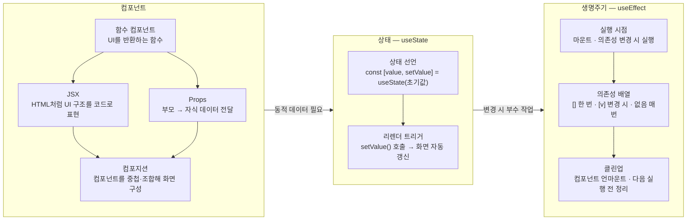

# 해결 방안 — React 핵심: 컴포넌트·상태·생명주기

## TO-BE 다이어그램

## 흐름 설명

세 개념이 독립적이지 않고 연결되어 있다. 컴포넌트는 화면을 함수 단위로 쪼개는 단위이고, 그 화면이 동적으로 바뀌어야 할 때 상태(useState)가 필요하고, 상태 변경에 반응하거나 마운트 시점에 부수 작업을 처리할 때 생명주기(useEffect)가 쓰인다. 세 개념을 각각 이해한 뒤 movie-search 실습에서 함께 엮어 실제 화면을 만들어야 이해가 굳는다.

## 컴포넌트 설명

**컴포넌트**

- **함수 컴포넌트** — UI를 반환하는 JavaScript 함수. `function SearchBar() { return <input /> }` 형태. 백엔드의 메서드처럼 독립 단위로 쪼갠다.
- **JSX** — HTML처럼 생긴 문법이지만 JavaScript 안에 들어간다. 빌드 시 `React.createElement()` 호출로 변환된다.
- **Props** — 부모 컴포넌트가 자식에게 데이터를 넘기는 방법. `<MovieCard title={movie.title} />` 형태. 백엔드의 메서드 파라미터·DTO 전달과 대응된다.
- **컴포지션** — 작은 컴포넌트를 조합해 복잡한 화면을 만드는 방식. `<SearchPage>` 안에 `<SearchBar>`, `<MovieList>`, `<MovieCard>` 를 중첩.

**상태 — useState**

- **상태 선언** — `const [value, setValue] = useState(초기값)`. `value`는 읽기 전용 현재 값, `setValue`는 변경 함수.
- **리렌더 트리거** — 변수에 직접 대입하는 것과 달리, `setValue()` 호출이 React에 "화면을 다시 그려라"를 알린다. 데이터 변화가 화면 갱신으로 이어지는 연결고리.

**생명주기 — useEffect**

- **실행 시점** — 컴포넌트가 화면에 나타난 직후(마운트), 또는 지정한 값이 바뀔 때 실행된다. 렌더 이후에 실행되므로 화면을 먼저 보여준 뒤 API를 호출하는 패턴이 자연스럽다.
- **의존성 배열** — `[]`이면 마운트 시 한 번, `[searchQuery]`이면 `searchQuery`가 바뀔 때마다, 배열 없으면 렌더마다 실행.
- **클린업** — `return () => { ... }` 형태로 정리 함수를 반환한다. 구독 해제·타이머 취소 등, 컴포넌트가 사라지거나 다음 실행 전에 이전 부수 작업을 정리한다.

**실습 및 산출물**

- **movie-search 실습** — 세 개념을 추상적으로 이해하는 것에서 나아가 실제 화면에 적용한다. 예: 검색 입력 컴포넌트(JSX·props), 검색어 관리(useState), 검색어 변경 시 API 호출(useEffect).
- **학습 산출물** — 세 개념을 백엔드 개발자 관점에서 풀어 정리한 노트. `problems/frontend-development/outcome/` 아래 누적.
- **이후 에픽 진입 가능** — React 핵심 모델을 갖추면 라우팅·커스텀 훅·API 연동 등 후속 에픽이 이 기반 위에서 진행된다.

## 미결정

- 실습 범위: movie-search에서 어느 화면까지 구현할지 — 검색 입력+결과 목록 정도를 기준으로 하되, plan-stories에서 Story 단위로 구체화.
- 컴포넌트 설계 깊이: 컴포넌트 분리 기준·폴더 구조를 이 에픽에서 다룰지, 별도 에픽(커스텀 훅·상태 관리)으로 넘길지 — 기초 구현 후 판단.
