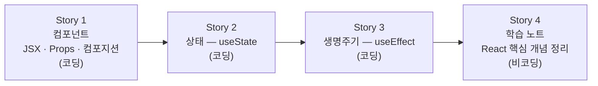

# React 핵심: 컴포넌트·상태·생명주기 — Story 목록

선행: [../2-explore/explore-solutions.md](../2-explore/explore-solutions.md)

## 전체 흐름

TO-BE 흐름(컴포넌트 → 상태 → 생명주기)을 그대로 따른다. 컴포넌트로 화면 구조를 잡고, 상태로 동적 데이터를 연결하고, 생명주기로 부수 작업을 제어하는 순서다. 세 코딩 Story가 끝난 뒤 실제로 써본 경험 위에서 학습 노트를 쓴다.

## Story 1 — 컴포넌트: JSX·Props·컴포지션 (코딩)

### 목적

movie-search 앱의 첫 화면을 함수 컴포넌트로 분리한다. JSX로 UI를 작성하고, props로 데이터를 넘기고, 컴포넌트를 중첩·조합하는 패턴을 익힌다.

### 실행 완료 기준

- `SearchBar` 컴포넌트 — 검색어 입력 UI (props로 value·onChange 수신)
- `MovieCard` 컴포넌트 — 영화 한 건 카드 UI (props로 title·poster 등 수신)
- `MovieList` 컴포넌트 — `MovieCard`를 목록으로 렌더링 (props로 movies 배열 수신)
- 위 세 컴포넌트를 `App`에서 컴포지션으로 조합해 화면 구성
- mock 데이터로 목록이 브라우저에 렌더링되는 것 확인
- 학습 노트 작성 — 함수 컴포넌트·JSX·props를 Java 메서드/DTO와 대응 관계로 정리
- Q&A 핑퐁 — 노트 작성 후 사용자 질문을 받아 답변하고 노트를 보충. 질문이 더 없을 때까지 반복

### ADR 후보

- 컴포넌트 파일 배치 — `components/` 단일 폴더 vs 기능 단위 폴더(`search/`, `movie/`) 분리. 이 에픽에서는 단순하게 `components/`로 시작하고, 에픽 #4(커스텀 훅) 이후 필요 시 재구성.

## Story 2 — 상태: useState (코딩)

### 목적

검색어 입력을 상태로 관리해 데이터 변화가 화면에 반영되는 React 반응성 모델을 익힌다.

### 실행 완료 기준

- `App` (또는 적절한 상위 컴포넌트)에서 `searchQuery` 상태 선언
- `SearchBar`에 `onChange` prop으로 상태 변경 함수 전달
- 검색어를 입력하면 상태가 바뀌고 화면이 갱신되는 것 브라우저에서 확인
- 상태 변경 → 리렌더 흐름을 React DevTools로 직접 확인
- 학습 노트 작성 — 변수 직접 변경과 다른 점, 리렌더 트리거 모델 정리
- Q&A 핑퐁 — 노트 작성 후 사용자 질문을 받아 답변하고 노트를 보충. 질문이 더 없을 때까지 반복

### ADR 후보

- 없음 (상태 위치는 Story 1 컴포넌트 구조에서 자연스럽게 결정)

## Story 3 — 생명주기: useEffect (코딩)

### 목적

상태 변화에 반응하는 부수 작업 처리 패턴을 익힌다. 의존성 배열로 실행 시점을 제어하고, 클린업으로 이전 작업을 정리하는 흐름을 이해한다.

### 실행 완료 기준

- `searchQuery` 상태 변경 시 `useEffect`가 실행되는 것 확인 (console.log로 먼저 검증)
- 의존성 배열 `[]` / `[searchQuery]` / 없음 세 가지 동작 차이를 직접 비교
- 클린업 함수로 이전 타이머(또는 이전 요청 취소 패턴) 정리
- 실제 TMDB API 호출은 에픽 #6(API 연동) 범위 — 여기서는 mock fetch 또는 setTimeout으로 패턴만 확인
- 학습 노트 작성 — 의존성 배열 세 가지 경우, 클린업이 필요한 이유 정리
- Q&A 핑퐁 — 노트 작성 후 사용자 질문을 받아 답변하고 노트를 보충. 질문이 더 없을 때까지 반복

### ADR 후보

- 없음

## Story 4 — 학습 노트 검토·정리 (비코딩)

### 목적

Story 1~3에서 각각 작성한 학습 노트를 통합 관점에서 검토한다. 세 개념이 어떻게 맞물리는지 한눈에 보이는 정리를 추가하고, 누락·오해가 있는 자리를 보완한다.

### 실행 완료 기준

- Story 1~3 학습 노트를 읽고 내용 누락·오해 자리 보완
- 세 개념이 어떻게 맞물려 동적 화면을 만드는지 연결 흐름 추가
- `problems/frontend-development/outcome/` 아래 최종 노트 완성
