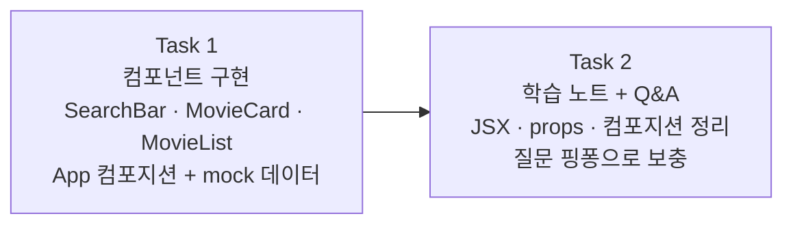

# Story 1 — Task 목록

선행: [../stories.md](../stories.md) §Story 1

## 전체 흐름

코드로 먼저 손에 익힌 뒤 글로 정리한다. Task 1에서 실제로 만들어보고, Task 2에서 그 경험을 언어로 굳힌다.

---

## Task 1 — 컴포넌트 구현

### 목표

`SearchBar` · `MovieCard` · `MovieList` 세 컴포넌트를 만들고 `App`에서 컴포지션으로 조합해, mock 데이터가 브라우저에 렌더링되는 상태를 만든다.

### 핵심 작업

- `SearchBar` — 검색어 입력 `<input>`, `value`·`onChange` props 수신
- `MovieCard` — 영화 한 건 카드, `title`·`poster` 등 props 수신
- `MovieList` — `movies` 배열 props 수신 → `MovieCard`를 목록으로 렌더링
- `App` — 세 컴포넌트를 컴포지션으로 조합, mock 데이터 인라인 선언
- 브라우저에서 목록 렌더링 확인

### 이 Task에서 하지 않을 것

- 상태 연결(useState) — Story 2 범위
- 실제 API 호출 — Story 3 / 에픽 #6 범위
- 스타일링 — 이 에픽 범위 밖

### 완료 기준

- 세 컴포넌트 파일이 `components/` 아래 존재하는 상태
- `App`에서 mock 데이터로 `MovieList`가 렌더링되는 것을 브라우저에서 확인한 상태
- `SearchBar`가 화면에 표시되는 상태 (동작은 Story 2에서)

---

## Task 2 — 학습 노트 + Q&A

### 목표

Task 1에서 직접 써본 경험을 바탕으로 학습 노트를 작성하고, 질문 핑퐁으로 이해를 보충한다.

### 핵심 작업

- 학습 노트 작성 — 함수 컴포넌트·JSX·props를 Java 메서드/DTO와 대응 관계로 정리
- Q&A 핑퐁 — 노트를 읽으며 생긴 질문을 자유롭게 던지고 답변 받으며 노트 보충. 질문이 더 없을 때까지 반복

### 이 Task에서 하지 않을 것

- 세 개념(컴포넌트·상태·생명주기) 전체 통합 정리 — Story 4 범위

### 완료 기준

- `problems/frontend-development/outcome/` 아래 컴포넌트 학습 노트가 존재하는 상태
- 사용자가 "질문 없음" 또는 다음으로 넘어가겠다고 한 상태

---

## 다음 사이클

Task 1·2 완료 후 Story 2(상태 — useState) 진입 직전에 story2/tasks.md를 별도 사이클로 작성.
