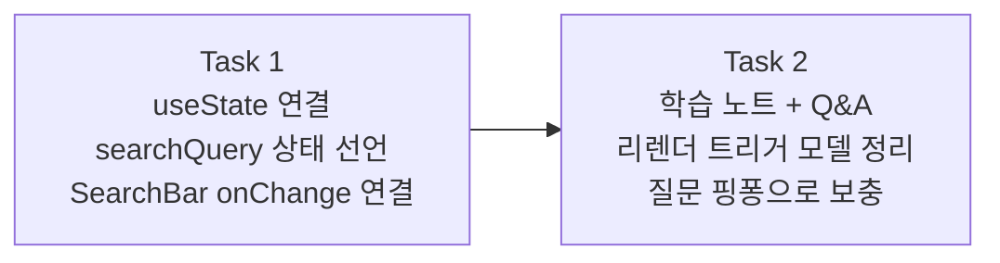

# Story 2 — Task 목록

선행: [../stories.md](../stories.md) §Story 2

## 전체 흐름

Story 1에서 비워뒀던 `onChange={() => {}}`를 실제 상태와 연결하는 것이 Task 1의 핵심이다. 코드로 동작을 확인한 뒤 Task 2에서 그 원리를 글로 정리한다.

---

## Task 1 — useState 연결

### 목표

`App`에 `searchQuery` 상태를 선언하고 `SearchBar`의 `value`·`onChange`에 연결해, 검색어 입력이 화면에 반영되는 상태를 만든다.

### 핵심 작업

- `App`에서 `const [searchQuery, setSearchQuery] = useState('')` 선언
- `SearchBar`에 `value={searchQuery}` · `onChange={setSearchQuery}` 전달
- 검색어 입력 시 상태 변경 → 화면 갱신 브라우저에서 확인
- React DevTools 컴포넌트 탭에서 `searchQuery` 상태 변경 · 리렌더 흐름 직접 확인

### 이 Task에서 하지 않을 것

- 검색어로 목록 필터링 — useEffect 또는 API 연동 범위
- 입력 디바운싱 — Story 3(useEffect) 범위

### 완료 기준

- `App`에 `searchQuery` 상태가 선언된 상태
- `SearchBar`에 입력하면 React DevTools에서 상태 값이 바뀌는 것이 보이는 상태

---

## Task 2 — 학습 노트 + Q&A

### 목표

Task 1에서 직접 경험한 useState 동작을 바탕으로 학습 노트를 작성하고, 질문 핑퐁으로 이해를 보충한다.

### 핵심 작업

- 학습 노트 작성 — 변수 직접 변경과 useState의 차이, 리렌더 트리거 모델 정리
- Q&A 핑퐁 — 노트를 읽으며 생긴 질문을 자유롭게 던지고 답변 받으며 노트 보충. 질문이 더 없을 때까지 반복

### 이 Task에서 하지 않을 것

- 컴포넌트 간 상태 공유(상태 끌어올리기) 심화 — 에픽 #5(상태 관리 심화) 범위

### 완료 기준

- `problems/frontend-development/outcome/` 아래 useState 학습 노트가 존재하는 상태
- 사용자가 질문 없음 또는 다음으로 넘어가겠다고 한 상태

---

## 다음 사이클

Task 1·2 완료 후 Story 3(생명주기 — useEffect) 진입 직전에 story3/tasks.md를 별도 사이클로 작성.
