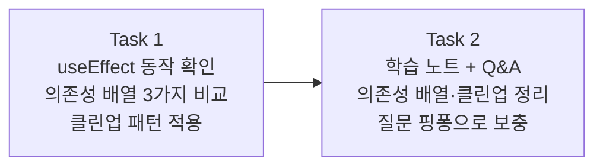

# Story 3 — Task 목록

선행: [../stories.md](../stories.md) §Story 3

## 전체 흐름

Story 2에서 비워뒀던 `onChange={() => {}}`를 상태로 연결했듯, 이번엔 상태 변화에 반응하는 부수 작업 처리 패턴을 익힌다. 코드로 직접 확인한 뒤 Task 2에서 원리를 정리한다.

---

## Task 1 — useEffect 동작 확인

### 목표

`searchQuery` 상태 변화에 반응하는 `useEffect`를 작성하고, 의존성 배열 세 가지 경우와 클린업 패턴을 브라우저에서 직접 확인한다.

### 핵심 작업

- `App`에 `useEffect` 추가 — `console.log`로 실행 시점 먼저 확인
- 의존성 배열 세 가지 직접 비교
  - `[]` — 마운트 시 1회만 실행
  - `[searchQuery]` — `searchQuery`가 바뀔 때마다 실행
  - 없음 — 매 렌더마다 실행
- `setTimeout` + `clearTimeout` 클린업 패턴 적용 — 입력이 멈춘 뒤 500ms 후에만 console.log 출력 (debounce 흉내)
- 브라우저 DevTools Console에서 실행 시점 차이 확인

### 이 Task에서 하지 않을 것

- 실제 TMDB API 호출 — 에픽 #6(API 연동) 범위
- 검색 결과로 목록 필터링 — mock fetch 패턴 이해가 목적이 아님

### 완료 기준

- 의존성 배열 세 가지 경우의 실행 시점 차이를 Console에서 눈으로 확인한 상태
- 클린업 함수가 실행되는 것(이전 타이머 취소)을 Console에서 확인한 상태

---

## Task 2 — 학습 노트 + Q&A

### 목표

Task 1에서 직접 경험한 useEffect 동작을 바탕으로 학습 노트를 작성하고, 질문 핑퐁으로 이해를 보충한다.

### 핵심 작업

- 학습 노트 작성 — 의존성 배열 세 가지 경우, 클린업이 필요한 이유 정리
- Q&A 핑퐁 — 노트를 읽으며 생긴 질문을 자유롭게 던지고 답변 받으며 노트 보충. 질문이 더 없을 때까지 반복

### 이 Task에서 하지 않을 것

- Story 1~3 개념 통합 정리 — Story 4(비코딩) 범위

### 완료 기준

- `problems/frontend-development/outcome/` 아래 useEffect 학습 노트가 존재하는 상태
- 사용자가 질문 없음 또는 다음으로 넘어가겠다고 한 상태

---

## 다음 사이클

Task 1·2 완료 후 Story 4(학습 노트 검토·정리, 비코딩) 진입 — plan-tasks 없이 바로 execute-task.
