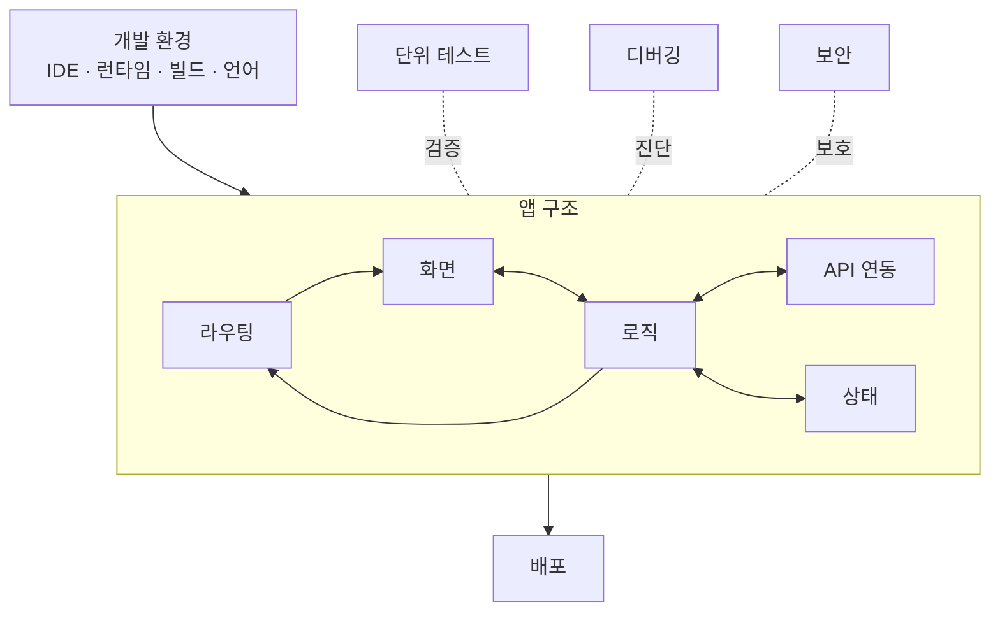

# 프론트엔드 개발·학습 — 구조

## 관심사 지도

개발 환경이 앱 구조의 기반을 깔고, 앱 구조 위에 세 횡단 관심사(테스트·디버깅·보안)가 걸리며, 완성된 구조가 배포로 이어진다.

**개발 환경**은 앱 구조가 존재하기 전에 깔아야 하는 기반이다. IDE·런타임·빌드 툴·언어 선택이 여기 속하며, 이 선택이 뒤에 쓸 수 있는 도구의 범위를 결정한다. 디버거 도구 셋업(launch.json·확장·UI)은 개발 환경 관리 프로젝트로 위임한다.

**앱 구조**는 라우팅·화면·로직·API 연동·상태 다섯 요소가 맞물리는 곳이다. 라우팅이 URL에 따라 어떤 화면을 보여줄지 결정하고, 화면은 사용자 입력을 받아 로직에 넘기고, 로직은 상태를 읽거나 쓰면서 API를 호출하거나 라우팅을 프로그래매틱으로 이동시킨다. 이 다섯 요소 사이의 경계를 어떻게 나누느냐가 아키텍처 패턴 선택의 핵심이다.

**테스트·디버깅·보안**은 앱 구조 전체에 걸쳐 있다. 테스트는 화면·로직·API 연동을 각각 검증하고, 디버깅은 컴포넌트 상태·비동기·소스맵을 통해 진단하고, 보안은 입력 처리·인증 통로·외부 데이터 신뢰 경계를 보호한다.

**배포**는 앱 구조가 완성된 다음 단계다. 컨테이너·웹 서버·호스팅 방식 선택이 여기 속한다.

### 각 관심사

- **개발 환경** — IDE(VSCode·플러그인·단축키) · 런타임(Node.js 버전) · 빌드 툴(Vite) · 언어(JS? TS?)
- **라우팅** — URL과 화면을 연결하는 규칙. 어떤 경로에 어떤 화면을 보여줄지 결정하고, 로직에서 프로그래매틱 이동을 처리한다.
- **화면** — 사용자에게 보이는 UI. 컴포넌트 단위로 구성.
- **로직** — 화면에서 떼어낸 처리. 화면·API·상태를 연결.
- **API 연동** — 서버와 데이터를 주고받는 통로. HTTP 요청·에러 처리·응답 변환.
- **상태** — 화면과 로직 사이에서 공유되는 데이터. 어디서 누가 소유하느냐가 상태 관리 전략의 핵심.
- **단위 테스트** — 화면(렌더링·전환) · 로직 · API 연동 · 픽스처 스터빙.
- **디버깅** — DevTools · 컴포넌트 상태·리렌더 추적 · 소스맵 · 비동기·상태관리 버그 진단 · 테스트 디버깅.
- **보안** — 입력 검증 · XSS · 인증 토큰 취급 · 외부 데이터 신뢰 경계.
- **배포** — 컨테이너(Docker?) · 웹 서버(NGINX?).

## React로 좁히기

위 관심사 지도가 *프론트엔드가 푸는 문제*라면, React는 그 문제를 지금 어떤 도구로 다루는지를 나타낸다. React 고유 선택(버전·DevTools·생태계 라이브러리)은 이 축에서 좁혀진다.

| 관심사 | React 선택 후보 | 메모 |
|---|---|---|
| 빌드 환경 | Vite + React | |
| 라우팅 | React Router | |
| 언어 | TypeScript | 타입 안전성 — 이 프로젝트 기본 전제 |
| 아키텍처 | 컴포넌트 계층 + 커스텀 훅 | 화면/로직 분리 단위 |
| 상태 관리 | Context API / Zustand / Redux Toolkit | 복잡도에 따라 선택 |
| 단위 테스트 | Vitest + Testing Library | Vite 기반 시 자연스러운 조합 |
| 디버깅 | React DevTools + 브라우저 DevTools | 컴포넌트 트리·리렌더 추적 |
| 보안 | React 기본 이스케이핑 + 인증 라이브러리 | dangerouslySetInnerHTML 회피 |
| 배포 | Docker + NGINX | |

## 에픽 운영 원칙

이 프로젝트는 *학습*이 목적이다. 따라서 모든 에픽은 동작하는 코드뿐 아니라 **학습 산출물**을 함께 남긴다 — 그 에픽에서 다룬 관심사가 무엇이고, 왜 그 선택을 했는지 정리한 노트.

- **코드** — `movie-search` 레포(예제 앱).
- **학습 정리** — `problems/frontend-development/outcome/` 아래 누적.

에픽 닫힘 조건은 "동작하는 결과물 + 그 에픽의 학습 산출물"을 함께 만족할 때다.
