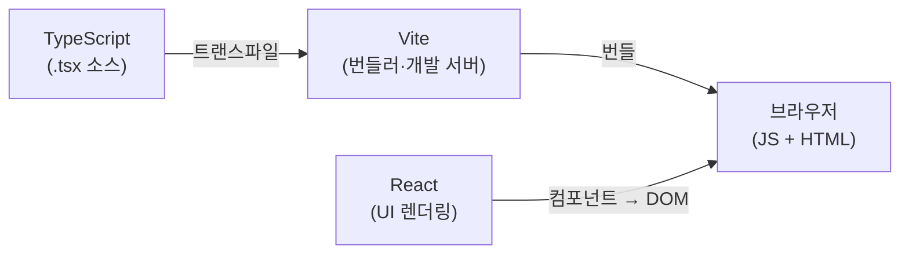
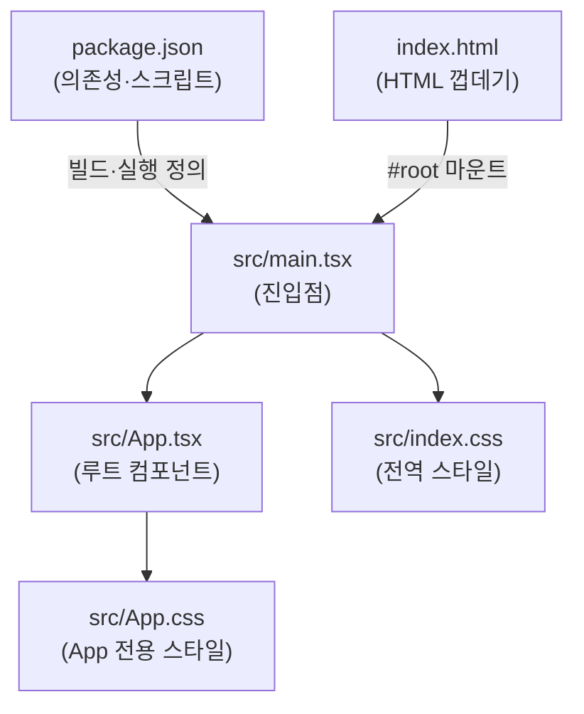

# 학습 노트: Vite + React + TypeScript 개발 환경

에픽: 예제 프로젝트 셋업 (Story 2)

## 이 조합이 하는 일



TypeScript로 작성한 소스를 Vite가 번들링해 브라우저에 전달하고, React가 그 결과를 화면(DOM)으로 만든다. 세 도구가 각자 다른 층을 담당한다.

---

## 각 도구의 역할

### Vite — 빌드 도구

백엔드로 치면 **Gradle/Maven**에 해당한다. 소스를 브라우저가 이해할 수 있는 JavaScript로 변환하고, 개발 중에는 로컬 서버를 띄워 변경사항을 즉시 반영(HMR)한다.

기존 번들러(Webpack)와의 차이는 속도다. Webpack은 전체 소스를 한 번에 번들링하는 반면, Vite는 개발 시 변경된 모듈만 교체해 시작 시간과 재로드 시간이 빠르다.

- `npm run dev` → 개발 서버 구동
- `npm run build` → 배포용 번들 생성

### React — UI 라이브러리

화면을 *컴포넌트* 단위로 쪼개어 관리한다. 상태가 바뀌면 React가 변경된 부분만 DOM에 반영한다. 백엔드의 MVC에서 View 층이 더 세분화된 형태로, 컴포넌트가 자신의 상태와 렌더링을 함께 가지고 있다.

JSX는 JavaScript 안에 HTML 구조를 직접 쓸 수 있는 문법 확장이다. 빌드 시 Vite가 일반 JavaScript로 변환한다.

### TypeScript — 타입 시스템

JavaScript에 타입을 얹은 언어다. Java에서 `String name`처럼 변수 타입을 명시하는 것과 같은 역할이다. 컴파일 시점에 오류를 잡고, IDE 자동완성·리팩터링 지원이 강해진다.

`.tsx` 확장자는 TypeScript + JSX를 함께 쓰는 파일이다.

---

## VSCode 프로젝트 설정이 하는 일

`.vscode/` 아래 두 파일이 이 레포 단위 개발 도구 환경을 정의한다. 전역 VSCode 설정과 독립적으로 동작한다.

### extensions.json — 권장 확장

레포를 처음 열면 설치 권장 팝업을 띄운다. 세 확장이 각각 다른 역할을 한다.

| 확장 | 역할 |
|---|---|
| `esbenp.prettier-vscode` | 저장 시 코드 자동 포매팅 |
| `dbaeumer.vscode-eslint` | 코드 품질 오류를 에디터에 표시 |
| `ms-vscode.vscode-typescript-next` | TypeScript 언어 지원·타입 검사 |

### settings.json — 워크스페이스 설정

```json
{
  "editor.defaultFormatter": "esbenp.prettier-vscode",
  "editor.formatOnSave": true,
  "editor.codeActionsOnSave": {
    "source.fixAll.eslint": "explicit"
  }
}
```

저장(`Cmd+S`) 한 번으로 Prettier 포매팅과 ESLint 자동 수정이 함께 실행된다.

### ESLint vs Prettier — 역할 구분

백엔드에서 Checkstyle(스타일 규칙)과 SpotBugs(코드 품질)를 구분하는 것과 비슷하다.

- **ESLint**: 코드 품질 — 미사용 변수, 잘못된 의존성 배열, 잠재적 버그 패턴
- **Prettier**: 코드 포맷 — 들여쓰기, 따옴표, 줄 바꿈, 세미콜론 유무

`eslint-config-prettier`는 ESLint가 포맷 관련 규칙을 켜지 않도록 막아, 두 도구가 겹치지 않게 한다.

---

## 프로젝트 파일 구조



### package.json — 의존성 명세 + 스크립트

백엔드의 `pom.xml` / `build.gradle`에 해당한다. 프로젝트에서 쓰는 라이브러리 목록(`dependencies`, `devDependencies`)과 자주 쓰는 명령 단축어(`scripts`)를 정의한다.

- `dependencies` — 런타임에 필요한 패키지 (React 등)
- `devDependencies` — 개발·빌드 시에만 필요한 패키지 (Vite, ESLint, Prettier 등)
- `scripts` — `npm run dev`, `npm run build` 같은 명령의 실제 내용

### index.html — HTML 껍데기

브라우저가 처음 받는 파일. `<div id="root"></div>` 하나만 있고, React가 이 안에 화면 전체를 그린다. 직접 편집할 일은 거의 없다.

### src/main.tsx — 진입점

Java의 `main()` 메서드, Spring Boot의 `@SpringBootApplication` 클래스와 같은 역할이다. `index.html`의 `#root` 요소를 찾아 React 앱을 연결(마운트)한다. `App` 컴포넌트를 루트로 삼아 렌더링을 시작하는 한 줄이 핵심이다.

```tsx
createRoot(document.getElementById('root')!).render(<App />)
```

### src/App.tsx — 루트 컴포넌트

앱의 최상위 컴포넌트. 현재는 `<h1>Movie Search</h1>` 하나지만, 앞으로 라우터·레이아웃·하위 컴포넌트가 여기에 붙는다. 앱 전체 구조의 출발점.

### src/index.css vs src/App.css

| 파일 | 적용 범위 | 담을 내용 |
|---|---|---|
| `index.css` | 전체 페이지 | CSS 변수, body 리셋, 타이포그래피 등 전역 기반 스타일 |
| `App.css` | App 컴포넌트 | App 레벨 레이아웃 스타일 |

`index.css`는 `main.tsx`에서, `App.css`는 `App.tsx`에서 각각 import된다. 컴포넌트가 늘어나면 각 컴포넌트 옆에 `ComponentName.css`를 두는 패턴으로 확장된다.
