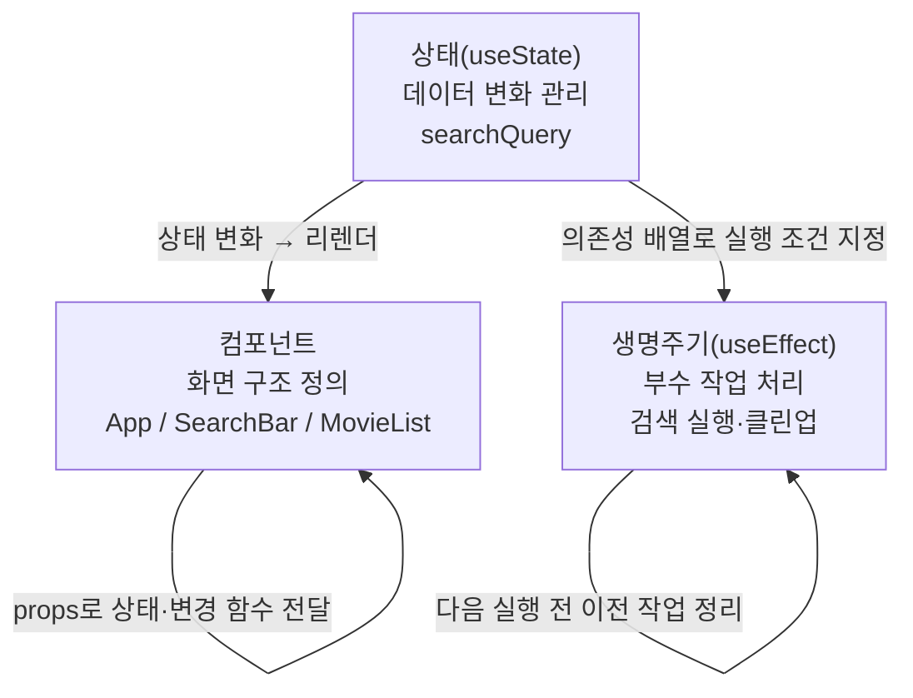

# React 핵심 개념 연결 — 컴포넌트 · 상태 · 생명주기

세 개념이 맞물려 동적 화면을 만드는 흐름을 movie-search 앱으로 정리한다.

## 전체 구조



## 역할 분담

- **컴포넌트** — 화면이 *어떻게 생겼는지* 정의한다. 상태를 직접 관리하지 않고 props로 받아 보여준다.
- **상태(useState)** — *무엇이 바뀌는지* 관리한다. 상태가 바뀌면 리렌더를 유발해 화면을 갱신한다.
- **생명주기(useEffect)** — 상태가 바뀌면 *무엇을 할지* 처리한다. 렌더링 바깥의 부수 작업(API 호출, 타이머 등)을 담당한다.

## movie-search 앱에서의 흐름

```
사용자가 검색창에 타이핑
  → SearchBar의 onChange 호출
  → setSearchQuery(value)          ← useState
  → React: App 리렌더 예약
  → App 재실행, searchQuery = 새 값
  → SearchBar value={searchQuery}  ← 컴포넌트가 새 값 반영
  → useEffect([searchQuery]) 실행  ← 상태 변화에 반응
  → 이전 타이머 클린업
  → 500ms 후 검색 실행 (현재는 console.log, 에픽 #6에서 API 호출로 교체)
```

## 각 개념의 경계

컴포넌트는 상태를 *소유*하거나 *전달받아* 보여준다. 직접 바꾸지 않는다.

상태는 컴포넌트 안에 선언하지만, 관심사는 데이터 변화와 리렌더 신호다. 화면 모양에는 관여하지 않는다.

useEffect는 렌더링이 끝난 뒤 실행된다. 렌더 도중 화면에 영향을 주지 않고, 렌더 결과에 반응해 외부 작업을 처리한다.
